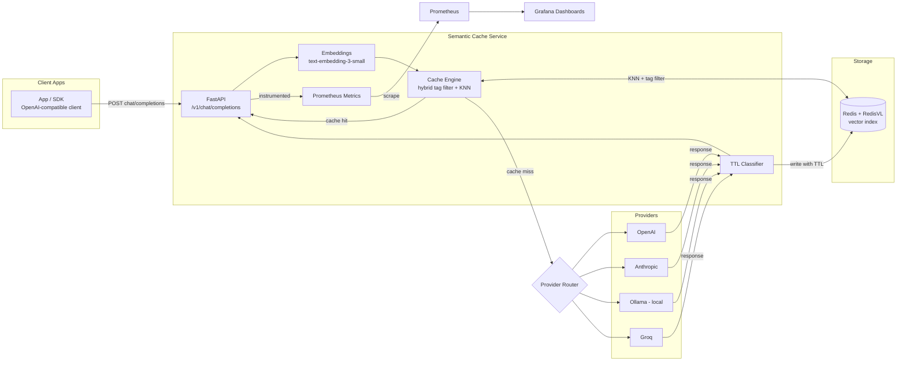

# Semantic Caching Layer for LLM APIs

> **A drop-in caching layer that reduced LLM API costs by `[X]%` and P95 latency by `[Y]%` on a 2,000-request load test.**
>
> *(Placeholders above — run `load_test/load_test.py` against your deployment and paste the real numbers from `load_test/results.json` into this line before sharing externally. See [Load Test Results](#load-test-results) for how to reproduce.)*

## Why this exists

Every repeated or near-duplicate prompt we send to an LLM provider is money and latency we didn't have to spend. Internal usage patterns (support bots, docs Q&A, internal copilots) tend to have a *lot* of semantic repetition — different phrasings of the same question, the same system prompts hit thousands of times a day, the same "explain X" requests from different users.

This service sits between our applications and the LLM providers as a transparent proxy. It's wire-compatible with the OpenAI Chat Completions API, so switching to it is a `base_url` change, not a code change. When it recognizes a semantically similar request it's already answered (within a configurable similarity threshold, and only when the system prompt and generation parameters also match), it returns the cached answer in single-digit milliseconds instead of round-tripping to the provider.

## Architecture



**Request flow, in words:**
1. A client sends a normal OpenAI-shaped `POST /v1/chat/completions` request.
2. The service embeds the latest user message (`text-embedding-3-small`, with a deterministic mock fallback for offline dev/CI).
3. It runs a **hybrid lookup** against Redis: first a tag filter on `(provider, system_prompt_hash, generation_param_hash)` so we only ever compare requests that are actually compatible, then a KNN(k=1) cosine-similarity vector search within that filtered set.
4. If the top match's similarity ≥ the active threshold (default `0.95`, adaptive per request type — see below), the cached response is returned immediately — as a normal JSON response, or replayed as an SSE stream if `stream: true`.
5. On a miss, the request is routed to the correct provider (`gpt-*` → OpenAI, `claude-*` → Anthropic, `ollama/*` → local Ollama, `groq/*` (or a recognized Groq model name) → Groq) based on the `model` field. Streaming responses are forwarded to the client in real time while being buffered in the background for storage.
6. The full response is written back to Redis with a **content-aware TTL**: prompts that look time-sensitive ("today", "weather", "latest", "current price", etc.) get a short TTL (1h default); everything else gets a longer TTL (24h default).
7. Every step is instrumented with Prometheus counters/histograms, visualized in a pre-built Grafana dashboard.

### Why hash the system prompt and parameters separately from the vector search?

Two requests can be semantically close in *user message* embedding space while meaning completely different things once you account for a different system prompt ("You are a pirate" vs. "You are a formal legal assistant") or different generation parameters (`temperature: 0` vs `temperature: 1.2`, or a different `model`). Rather than relying on the vector search alone, we pre-filter with an exact tag match on `SHA256(system_prompt)` and `SHA256(stable_json(params))`, then run the vector search *inside* that filtered set. This keeps false-positive cache hits close to zero without adding meaningful latency, since Redis tag filters are essentially free compared to the vector search itself.

## Key Features

| Feature | Detail |
|---|---|
| Drop-in OpenAI-compatible API | `POST /v1/chat/completions`, same request/response shape |
| Multi-provider | OpenAI, Anthropic, Ollama (local), Groq — routed by `model` prefix |
| Streaming | Cache hits stream instantly; misses stream live from the provider while buffering for storage |
| Hybrid cache key | Vector similarity **and** exact match on system prompt + parameters |
| Content-aware TTL | Rule-based classifier assigns short TTL to time-sensitive prompts, long TTL to stable/factual ones |
| Adaptive thresholds | Per-request override (`x_threshold`) or automatic, based on request-type heuristics (factual / creative / classification / time-sensitive) |
| Invalidation | By system-prompt hash, by model/provider, or by Redis key prefix (e.g. after a model upgrade) |
| Near-miss logging | Queries that almost hit are logged for offline threshold tuning |
| Observability | Prometheus metrics + provisioned Grafana dashboard (hit rate, cost savings, latency percentiles, cache size, similarity distribution) |
| Fully containerized | `docker-compose up --build` brings up API, Redis (RedisVL), Prometheus, Grafana, and (optionally) Ollama |

## Repository Layout

```
semantic-cache/
├── app/
│   ├── main.py                # FastAPI entrypoint, startup/shutdown wiring
│   ├── config.py               # Env-driven settings (pydantic-settings)
│   ├── models.py                # OpenAI-compatible request/response schemas
│   ├── embeddings.py            # OpenAI embeddings wrapper + mock fallback
│   ├── providers.py             # OpenAI / Anthropic / Ollama / Groq abstraction + streaming
│   ├── cache_engine.py          # Hybrid similarity search, storage, invalidation
│   ├── ttl_classifier.py        # Rule-based content-aware TTL assignment
│   ├── near_miss_analyzer.py    # Logs near-miss queries for offline tuning
│   ├── metrics.py               # Prometheus counters/histograms/gauges
│   └── routes.py                # All HTTP endpoints
├── redis_index/
│   └── index_schema.py          # RedisVL index schema + idempotent creation
├── monitoring/
│   ├── prometheus.yml
│   └── grafana/provisioning/    # Datasource + pre-built dashboard JSON
├── load_test/
│   └── load_test.py             # 2,000-request async load test (40/30/30 mix)
├── scripts/
│   ├── threshold_tuner.py       # Offline: sweep thresholds against near-miss logs
│   └── invalidate.py            # CLI: invalidate by hash/model/prefix
├── tests/
│   └── test_core.py             # Unit tests (hashing, TTL rules, embeddings)
├── Dockerfile
├── docker-compose.yml
├── requirements.txt
└── .env.example
```

## Using Groq

Groq's API is OpenAI-compatible, so it's wired in as a first-class provider — but it's worth understanding exactly what it does and doesn't replace here.

**What Groq replaces:** the actual chat completion call on a cache miss (fast inference over models like Llama 3.3, Mixtral, Gemma).

**What Groq does *not* replace:** embeddings. Groq doesn't currently offer an embeddings endpoint, so the similarity lookup that decides hit-vs-miss still needs either an OpenAI key (`OPENAI_API_KEY`) or mock embeddings (`USE_MOCK_EMBEDDINGS=true`). If you only have a Groq key, mock mode is the default — you get full cache mechanics (routing, storage, TTL, invalidation, metrics) for free, with the caveat that "similar but reworded" hits won't be semantically meaningful in mock mode (only exact repeats will match reliably).

**Setup:**

```bash
# in .env
GROQ_API_KEY=gsk_...
# optional — only needed if it differs from the default:
GROQ_BASE_URL=https://api.groq.com/openai/v1
```

**Calling a Groq model** — either prefix the model name with `groq/`, or use a recognized Groq model name directly (no prefix needed for common ones like `llama-3.3-70b-versatile`):

```bash
curl http://localhost:8000/v1/chat/completions \
  -H "Content-Type: application/json" \
  -d '{
        "model": "groq/llama-3.3-70b-versatile",
        "messages": [{"role": "user", "content": "Explain the water cycle in simple terms."}]
      }'
```

or equivalently, without the prefix:

```bash
curl http://localhost:8000/v1/chat/completions \
  -H "Content-Type: application/json" \
  -d '{
        "model": "llama-3.3-70b-versatile",
        "messages": [{"role": "user", "content": "Explain the water cycle in simple terms."}]
      }'
```

Both requests are cached under `provider="groq"`, so repeats and semantic rephrasings of either form will hit each other's cache entries as long as `model`, `temperature`, and other generation parameters match.

**Model routing reference:**

| `model` value | Routed to |
|---|---|
| `gpt-*`, `o1*`, `o3*` | OpenAI |
| `claude-*` | Anthropic |
| `ollama/*` | Local Ollama |
| `groq/*`, or a known Groq model name (`llama-3.3-70b-versatile`, `llama-3.1-8b-instant`, `mixtral-8x7b-32768`, `gemma2-9b-it`, etc.) | Groq |
| anything else | OpenAI by default, or Groq if `DEFAULT_TO_GROQ=true` is set |

**If you only have a Groq key and no OpenAI key:** set `DEFAULT_TO_GROQ=true` so unrecognized/ambiguous model names fall back to Groq instead of failing against a missing OpenAI key, and leave `USE_MOCK_EMBEDDINGS` unset — it defaults to mock automatically whenever `OPENAI_API_KEY` is blank, regardless of the flag's literal value.

Groq's hosted model list changes over time — check [console.groq.com/docs/models](https://console.groq.com/docs/models) for the current set, and prefer the explicit `groq/` prefix over relying on the built-in recognized-model list, which is not exhaustive.

## Deployment Guide

### 1. Configure

```bash
cp .env.example .env
# Fill in OPENAI_API_KEY / ANTHROPIC_API_KEY as needed.
# For a fully offline smoke test, set USE_MOCK_EMBEDDINGS=true instead.
```

### 2. Run

```bash
docker-compose up --build
```

This starts:
- **api** — the FastAPI service on `:8000`
- **redis** — Redis Stack (includes RedisVL's vector search module) on `:6379`
- **prometheus** — on `:9090`
- **grafana** — on `:3000` (default login `admin` / `admin`, override in `.env`)
- **ollama** (optional) — start it with `docker-compose --profile ollama up --build` if you want to route `ollama/*` models locally

### 3. Verify

```bash
curl http://localhost:8000/health

curl http://localhost:8000/v1/chat/completions \
  -H "Content-Type: application/json" \
  -d '{
        "model": "gpt-4o-mini",
        "messages": [{"role": "user", "content": "Explain the water cycle in simple terms."}]
      }'
# First call: Cache-Hit: false
# Re-run the same request:
# Second call: Cache-Hit: true, and near-instant.
```

Open Grafana at `http://localhost:3000` → the "Semantic Cache Overview" dashboard is provisioned automatically.

### 4. Point your application at it

Anywhere your app currently calls `https://api.openai.com/v1/chat/completions`, point it at `http://<this-service>:8000/v1/chat/completions` instead. No other client-side changes required for basic usage. Optional extensions (`x_threshold`, `x_request_type`, `x_no_cache`) are additive fields your client can ignore if unused.

## Cache Invalidation

```bash
# Invalidate everything under a given system prompt (e.g. it changed)
python scripts/invalidate.py by-hash --system-hash <sha256>

# Invalidate everything for a provider (e.g. after a model upgrade you don't trust yet)
python scripts/invalidate.py by-hash --model openai

# Invalidate by Redis key prefix
python scripts/invalidate.py by-prefix --prefix openai:abc123
```

Or via HTTP directly: `POST /cache/invalidate`, `DELETE /cache/prefix/{prefix}`.

## Tuning the Similarity Threshold

The default threshold (`0.95`) is deliberately conservative to avoid returning a wrong-but-similar cached answer. Two ways to tune it:

1. **Live simulation**: `GET /threshold/simulate?threshold=0.90` replays recent near-miss data and estimates the hit rate at that threshold.
2. **Offline analysis**: `python scripts/threshold_tuner.py --log-path logs/near_misses.jsonl` sweeps a threshold range against accumulated near-miss logs and suggests where marginal hit-rate gains flatten out.

Adaptive per-request-type thresholds are already applied automatically (classification-style prompts tolerate looser matching; creative-generation prompts require near-exact matches), and can be overridden per request via `x_threshold` or `x_request_type` in the request body.

## Load Test Results

`load_test/load_test.py` simulates a realistic mixed traffic pattern against `/v1/chat/completions`:

- **40%** unique prompts (should always miss)
- **30%** identical repeats of a small prompt pool (should hit after the first occurrence)
- **30%** semantically similar rephrasings of common topics (should hit if within threshold)

```bash
# with the stack running (docker-compose up):
python load_test/load_test.py --base-url http://localhost:8000 --requests 2000 --concurrency 50
```

This prints a JSON summary and writes it to `load_test/results.json`:

```json
{
  "total_requests": 2000,
  "hits": "<measured>",
  "misses": "<measured>",
  "hit_rate_pct": "<measured>",
  "latency_hit_p50_ms": "<measured>",
  "latency_hit_p95_ms": "<measured>",
  "latency_miss_p50_ms": "<measured>",
  "latency_miss_p95_ms": "<measured>",
  "overall_p95_ms": "<measured>",
  "p95_latency_improvement_pct": "<measured>",
  "estimated_cost_savings_usd": "<measured>"
}
```

> **Note:** actual numbers depend on your provider latency, network conditions, and real embedding model (vs. mock mode), so they're intentionally left as placeholders here rather than fabricated. Run the load test against your target environment and drop the real `hit_rate_pct` and `p95_latency_improvement_pct` into the headline at the top of this document before presenting it.

### Cost Savings Projection (methodology)

Cost savings are estimated per cache hit as:

```
savings = (prompt_tokens / 1000) * cost_per_1k_input_tokens
        + (completion_tokens / 1000) * cost_per_1k_output_tokens
```

using the token counts from the originally-cached response, so the projection reflects the actual size of the responses being served from cache rather than a flat estimate. This is tracked live as the `cost_savings_dollars` Prometheus counter and surfaced on the Grafana dashboard. To project savings at your real traffic volume: `estimated_savings_at_scale = (measured_hit_rate) × (your_daily_LLM_spend)`.

## Demo Script

For a live walkthrough (e.g. in a team demo):

1. Send a fresh, unique prompt — show `Cache-Hit: false` and note the latency in the response headers.
2. Send the *exact same* prompt again — show `Cache-Hit: true` and the dramatically lower latency.
3. Send a *reworded* version of the same question (e.g. "Can you explain X?" vs. "What is X?") — show it also hits, with the `X-Similarity-Score` header just under 1.0.
4. Pull up the Grafana dashboard (`http://localhost:3000`) and point at the hit-rate and cost-savings panels ticking up in real time.
5. Run `load_test/load_test.py` live and watch the dashboard's request-rate and latency panels respond.

## Testing

```bash
pip install -r requirements.txt
pytest tests/ -v
```

Unit tests cover hashing stability, TTL classification rules, request-type classification, and the mock embedding fallback — all runnable without a live Redis or provider connection. End-to-end behavior (actual cache hits/misses) is exercised by the load test against a running stack.

## Security Notes

- No secrets are hardcoded anywhere in this repo; all credentials come from environment variables (`.env`, excluded from version control — see `.env.example` for the full list).
- The service does not log full prompt/response bodies by default beyond what's needed for the cache itself and near-miss analysis (capped at 2,000 characters per entry).
- Cache entries expire via Redis TTL; there's no unbounded growth as long as `TTL_LONG_SECONDS` is set sensibly for your data sensitivity requirements.

## Known Limitations / Follow-ups

- The TTL classifier is intentionally simple (regex-based) for speed and auditability; a learned classifier could be swapped in via `ttl_classifier.py` if keyword rules prove too coarse.
- `threshold/simulate` currently estimates off logged near-misses only, not a full historical query log; for a more rigorous analysis, extend `near_miss_analyzer.py` to log *all* lookups (not just near misses) if storage volume allows.
- Streaming cache hits currently replay as a single chunk rather than re-chunked to mimic the original token-by-token cadence — functionally identical to the client, but worth knowing if you're testing token-level timing.
